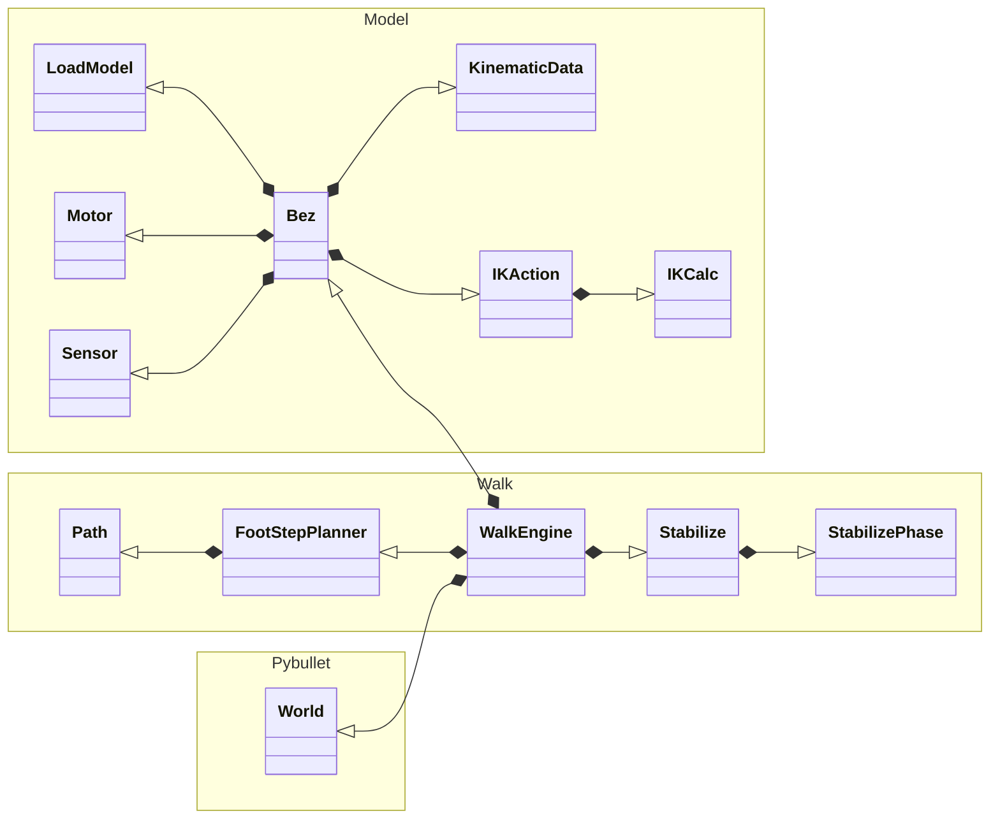

# Documentation

###

```mermaid
%%{init: {"classDiagram": {"useMaxWidth": false}} }%%
classDiagram
    direction LR
    namespace Model {
        class Bez
        class Motor
        class Sensor
        class LoadModel
        class KinematicData
        class IKAction
        class IKCalc
    }
    namespace Walk {
        class WalkEngine
        class FootStepPlanner
        class Path
        class Stabilize
        class StabilizePhase

    }
    namespace Pybullet {
        class World

    }
%%    Bez *--|> LoadModel
    LoadModel <|--* Bez
%%    Bez *--|> Motor
    Motor <|--* Bez
%%    Bez *--|> Sensor
    Sensor <|--* Bez

    Bez *--|> KinematicData
    Bez *--|> IKAction
    IKAction *--|> IKCalc


%%    Nav *--|> FootStepPlanner
    FootStepPlanner <|--* WalkEngine
%%    FootStepPlanner *--|> Path
    Path <|--* FootStepPlanner

    WalkEngine *--|> Stabilize
    Stabilize *--|> StabilizePhase

%%    Nav *--|> World
    World <|--* WalkEngine
%%    Nav *--|> Bez
    Bez <|--* WalkEngine


```
