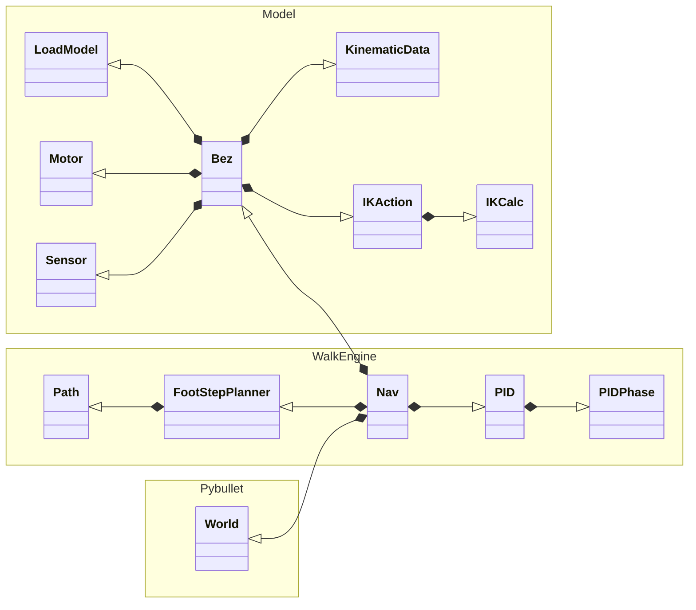

# Documentation

###

```mermaid
%%{init: {"classDiagram": {"useMaxWidth": false}} }%%
classDiagram
    direction LR
    namespace Model {
        class Bez
        class Motor
        class Sensor
        class LoadModel
        class KinematicData
        class IKAction
        class IKCalc
    }
    namespace WalkEngine {
        class Nav
        class FootStepPlanner
        class Path
        class PID
        class PIDPhase

    }
    namespace Pybullet {
        class World

    }
%%    Bez *--|> LoadModel
    LoadModel <|--* Bez
%%    Bez *--|> Motor
    Motor <|--* Bez
%%    Bez *--|> Sensor
    Sensor <|--* Bez

    Bez *--|> KinematicData
    Bez *--|> IKAction
    IKAction *--|> IKCalc


%%    Nav *--|> FootStepPlanner
    FootStepPlanner <|--* Nav
%%    FootStepPlanner *--|> Path
    Path <|--* FootStepPlanner

    Nav *--|> PID
    PID *--|> PIDPhase

%%    Nav *--|> World
    World <|--* Nav
%%    Nav *--|> Bez
    Bez <|--* Nav


```
