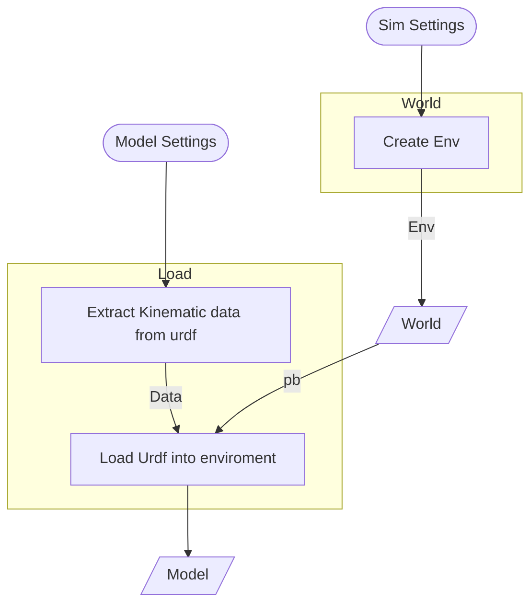
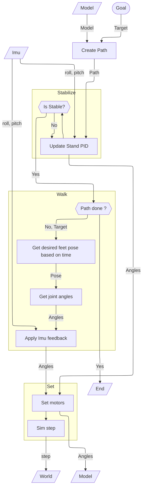
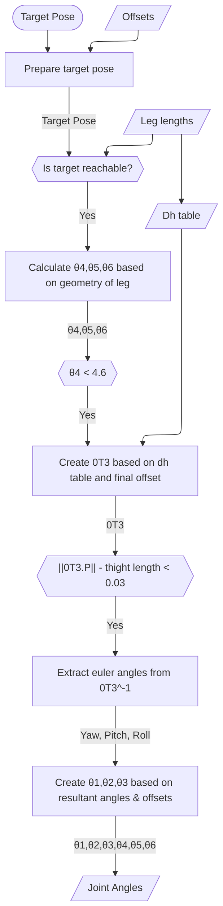
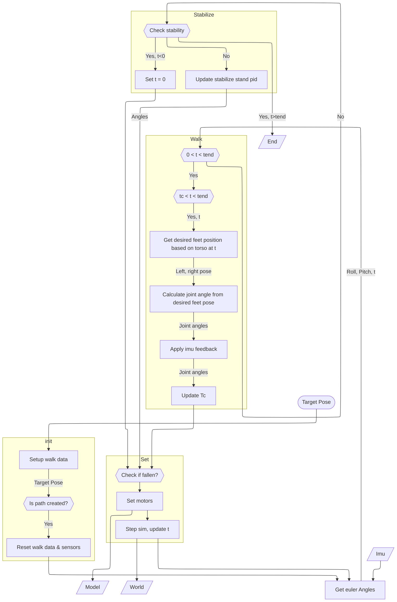

# Documentation

### Pybullet World

```mermaid
%%{init: {"flowchart": {"useMaxWidth": false}} }%%
flowchart
    I1([Sim Settings])
    I2([Model Settings])
    O1[/World/]
    O2[/Model/]

    I1 --> A
    I2 --> B
    A --Env--> O1
    B --Data--> C
    O1 --pb--> C
    C --> O2

    subgraph World
        A[Create Env]

    end
    subgraph Load

        B[Extract Kinematic data from urdf]
        C[Load Urdf into enviroment]

    end


```

### Walk Engine

```mermaid
%%{init: {"flowchart": {"useMaxWidth": false}} }%%
flowchart-elk

    O1[/World/]
    O2[/Model/]
    O3[/End/]

    I1[/Model/]
    I2([Goal])
    I3[/Imu/]

    A[Create Path]

    I1 --Model--> A
    I2 --Target--> A
    I3 --roll, pitch--> B
    I3 --roll, pitch--> G

    A --Path--> B
    B --Angles--> H
    B --> C
    C --No --> B
    C --Yes--> D
    D --No, Target--> E
    E --Pose--> F
    F --Angles--> G
    G --Angles--> H
    H --> J

    H --Angles-->O2
    J --step--> O1
    D --Yes--> O3

    subgraph Stabilize
        B[Update Stand PID]
        C{{Is Stable?}}
    end

    subgraph Walk
        D{{Path done ?}}
        E[Get desired feet pose based on time]
        F[Get joint angles]
        G[Apply Imu feedback]
    end
    subgraph Set
        H[Set motors]
    J[Sim step]
    end


```

### Inverse Kinematics

```mermaid
%%{init: {"flowchart": {"useMaxWidth": false}} }%%
flowchart-elk

    O1[/Joint Angles/]
%%    O2[/End/]

    I1([Target Pose])
    I2[/Offsets/]
    I3[/Leg lengths/]
    I4[/Dh table/]

    A[Prepare target pose]
    B{{Is target reachable?}}
    C[Calculate θ4,θ5,θ6 based on geometry of leg]
    D{{θ4 < 4.6}}
    E[Create 0T3 based on dh table and final offset]
    F{{"||0T3.P|| - thight length < 0.03"}}
    G[Extract euler angles from 0T3^-1]
    H[Create θ1,θ2,θ3 based on resultant angles & offsets]


    I1 --> A
    I2 --> A
    I3 --> I4
    I3 --> B
    I4 --> E

    A --Target Pose--> B
    B --Yes--> C
%%    B --No --> O2
    C --θ4,θ5,θ6--> D
    D --Yes--> E
%%    D --No --> O2
    E --0T3--> F
    F --Yes--> G
%%    F --No --> O2
    G --Yaw, Pitch, Roll--> H

    H --θ1,θ2,θ3,θ4,θ5,θ6--> O1

```

### Navigation TODO fix

```mermaid
%%{init: {"flowchart": {"useMaxWidth": false}} }%%
flowchart-elk

    O1[/Model/]
    O2[/World/]
    O3[/End/]

    I1([Target Pose])
    I2[/Imu/]


    A[Setup walk data]
    B{{Is path created?}}
    C[Reset walk data & sensors]
    D[Get euler Angles]


    I1 --> A
    I2 --> D

    A --Target Pose--> B
    B --Yes--> C
    C --> D
    D --Roll, Pitch, t--> E
    E --No --> H
    H --Yes, t<0--> J
    J --> P
    H --Yes, t>tend--> O3
    H --No --> F
    F --Angles--> P
    P --> G

    G --> Q
    Q --> D

    E --Yes-->K
    K --Yes, t--> L
    L --Left, right pose-->M
    M --Joint angles-->N
    N --Joint angles--> O
    O --> P


    G --> O1
    Q --> O2


    subgraph Stabilize
        F[Update stabilize stand pid]
            H{{Check stability}}
    J[Set t = 0]
    end

    subgraph Walk
       E{{0 < t < tend}}
        K{{tc < t < tend}}
        L[Get desired feet position based on torso at t]
        M[Calculate joint angle from desired feet pose]
        N[Apply imu feedback]
        O[Update Tc]
    end
    subgraph Set
       P{{Check if fallen?}}
        Q[Step sim, update t]
        G[Set motors]

    end
    subgraph init
            A[Setup walk data]
        B{{Is path created?}}
        C[Reset walk data & sensors]
    end


```
