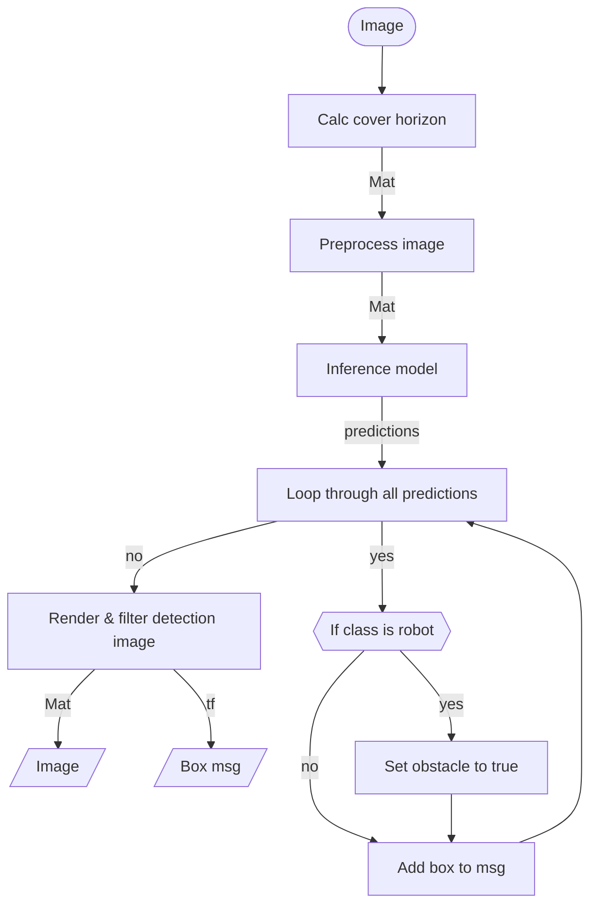

# Documentation

### Image Callback

```mermaid
%%{init: {"flowchart": {"useMaxWidth": false}} }%%
flowchart

    O1[/Image/]
    O2[/Box msg/]

    I1([Image])


    A[Calc cover horizon]
    B[Preprocess image]
    C[Inference model]
    D[Loop through all predictions]
    E{{If class is robot}}
    F[Set obstacle to true]
    G[Add box to msg]
    H[Render & filter detection image]


    I1 --> A
    A --Mat--> B
    B --Mat--> C
    C --predictions--> D
    D --yes--> E
    E --yes--> F
    E --no --> G
    F --> G
    G --> D
    D --no --> H
    H --tf--> O2
    H --Mat--> O1


```
