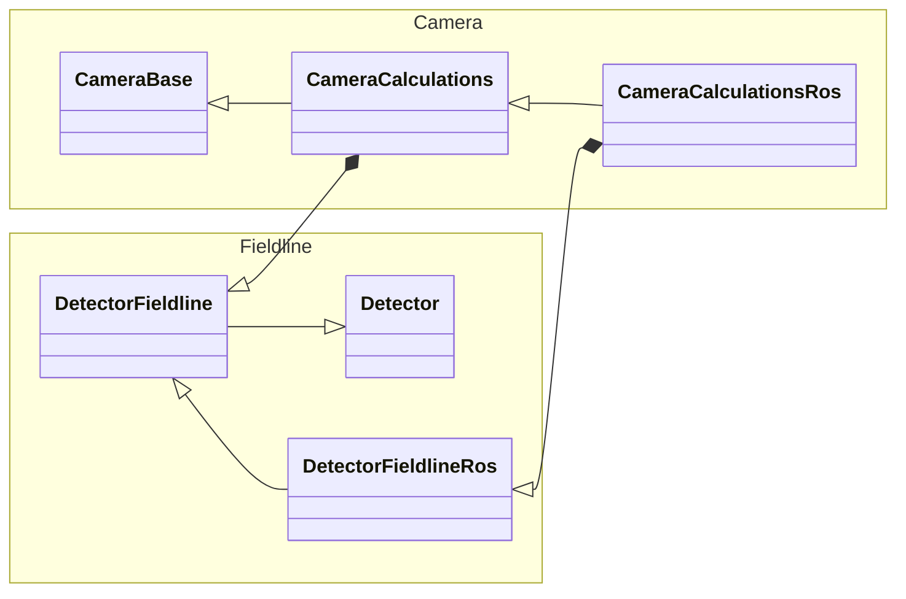

# Documentation

###

```mermaid
%%{init: {"classDiagram": {"useMaxWidth": false}} }%%
classDiagram
    direction LR
    namespace Fieldline {
        class Detector
        class DetectorFieldline
        class DetectorFieldlineRos

    }

    namespace Camera {
        class CameraBase
        class CameraCalculations
        class CameraCalculationsRos

    }

    DetectorFieldline --|> Detector
%%  Detector <|-- DetectorFieldline
    DetectorFieldline <|-- DetectorFieldlineRos
%%    DetectorFieldlineRos --|> DetectorFieldline

%%    CameraCalculations --|> CameraBase
    CameraBase <|-- CameraCalculations

    CameraCalculations <|-- CameraCalculationsRos

%%    CameraCalculations <|--* DetectorFieldline
    DetectorFieldline <|--* CameraCalculations

    DetectorFieldlineRos <|--* CameraCalculationsRos
%%    CameraCalculationsRos <|--* DetectorFieldlineRos


```
