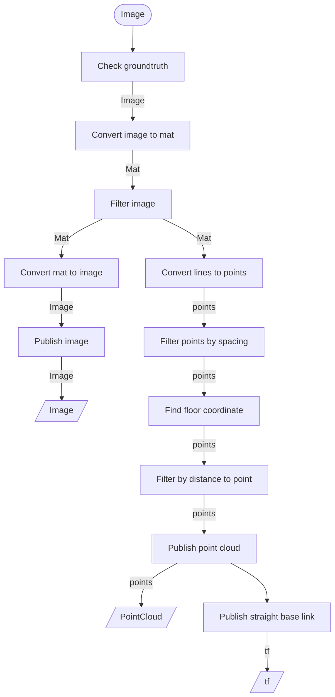

# Documentation

### Image Callback

```mermaid
%%{init: {"flowchart": {"useMaxWidth": false}} }%%
flowchart

    O1[/Image/]
    O2[/tf/]
    O3[/PointCloud/]

    I1([Image])


    A[Check groundtruth]
    B[Convert image to mat]
    C[Filter image]
    D[Convert lines to points]
    E[Filter points by spacing]
    F[Find floor coordinate]
    G[Filter by distance to point]
    H[Publish straight base link]
    J[Convert mat to image]
    K[Publish image]
    L[Publish point cloud]


    I1 --> A
    A --Image--> B
    B --Mat--> C
    C --Mat--> J
    J --Image--> K
    K --Image--> O1
    C --Mat--> D
    D --points--> E
    E --points--> F
    F --points--> G
    G --points--> L
    L --points--> O3
    L --> H
    H --tf--> O2


```
