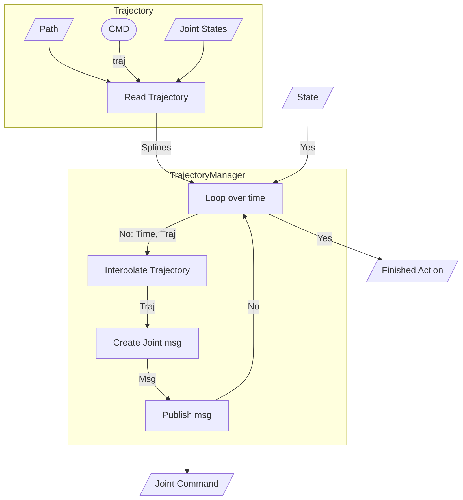

# Documentation

###

```mermaid
%%{init: {"flowchart": {"useMaxWidth": false}} }%%
flowchart

    O1[/Finished Action/]
    O2[/Joint Command/]


    I3[/State/]

    A --Splines--> B
    B --No: Time, Traj--> F
    F --Traj--> C
    C --Msg--> D
    D --No --> B

    B --Yes--> O1
    D --> O2

    I1 --> A
    I2 --traj--> A
    I3 --Yes--> B
    I4 --> A
    subgraph Trajectory
        I1[/Path/]
        I2([CMD])
        I4[/Joint States/]
        A[Read Trajectory]
    end

    subgraph TrajectoryManager
        B[Loop over time]
        F[Interpolate Trajectory]
        C[Create Joint msg]
        D[Publish msg]
    end


```
